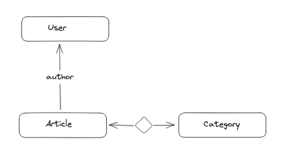

# DJsonApi: A framework to quickly write {json:api} servers in Django

Reference: [{json:api}](https://jsonapi.org/)

## Quick-start

Lets assume you have a Django project and a Django app called `articles`. Lets
also assume your project's root URL configuration has:

```python
urlpatterns = [
    ...,
    path('', include('articles.urls')),
    ...,
]
```

In our `articles/views.py` file we will add the following:

```python
import djsonapi
from .models import Article

class ArticleResource(djsonapi.Resource):
    TYPE = "articles"

    @classmethod
    def get_many(cls, request):
        return Article.objects.all()

    @classmethod
    def get_one(cls, request, obj_id):
        return Article.objects.get(id=obj_id)

    @classmethod
    def serialize(cls, obj):
        return {'id': str(obj.id),
                'attributes': {'title': obj.title, 'content': obj.content}}
```

In our `articles/urls.py` we will add the following:

```python
from .views import ArticleResource

urlpatterns = ArticleResource.as_views()
```

Now, when we try to interact with the server, we will get:

```python
# GET /articles → 200 OK
{'data': [{'type': "articles",
           'id': "1",
           'attributes': {'title': "How to make an omelette",
                          'content': "Just break some eggs"},
           'links': {'self': "/articles/1"}},
          ...],
 'links': {'self': "/articles"}}

 # GET /articles/1 → 200 OK
{'data': {'type': "articles",
          'id': "1",
          'attributes': {'title': "How to make an omelette",
                         'content': "Just break some eggs"},
          'links': {'self': "/articles/1"}},
         ...,
 'links': {'self': "/articles/1"}}
```

The `Resource` will figure out which URLs/Verbs are available based on what
classmethods we have implemented in our subclass. Furthermore, our classmethods
only return part of the final response. The actual views generated by
`Resource.as_views()` will postprocess them, filling in sensible defaults.

## Philosophy

Although this is a Django framework, it is meant to be **loosely** coupled to
Django. In fact, I believe it could be ported to other web frameworks without
much effort.

The "special" classmethods (like `get_one` and `get_many` in the previous
example) are meant as entry points for your business logic. Within them, you
can perform your business logic any way you like, and `djangoapi` will not make
any assumtpions about it. How to handle authentication, input validation,
permission checks, database access, filtering, pagination, etc will be up to
you to decide. You might miss the authentication hooks that
[django-rest-framework](https://www.django-rest-framework.org/) provides, but
Django itself allows you to write custom authentication backends.

Similarly, `djsonapi` does **not** make any assumptions about the types of your
return values. They can be ORM objects, querysets or instances of any custom
service class or list of such instances, so long as your `serialize` methods
can process them without raising errors.

Finally, `djsonapi` tries its best to make things easy. Your return values will
be automatically enhanced with things that would be tedious to figure out by
hand. Things like serialized values for related objects, links of relationships,
pagination links, etc.

The final goal is to allow you to easily expose a server's functionality to
clients in a very predictable manner. This, combined with a client SDK
framework for {json:api} APIs is a very powerful stack to build applications
on, either server-client or microservices based.

Suggested client SDKs:

- [`@transifex/jsonapi`](https://www.npmjs.com/package/@transifex/jsonapi)
- [`transifex-python/api/jsonapi`](https://github.com/transifex/transifex-python/blob/devel/transifex/api/README.md#transifexapijsonapi-usage)

An overview of the main features is:

- Generation of URL configuration for API resources
- Injection of URLs in server responses where needed
- Convenient handling of relationships
- Convenient handing of compound documents (aka including relationship data in
  the response)
- Convenient handling of pagination links
- Convenient handling of exceptions
- Mapping relationship views to each other to reduce repetition (eg
  `/category/:id/articles` → `/articles?filter[category]=:id`)
- Validation of query parameters (GET variables) and request payloads
- Automatic support of the `?limit[:type]` functionality as described by
  {json:api}

## Installation

```sh
git clone https://github.com/kbairak/djsonapi
cd djsonapi
pip install .
pip install -e .  # if you want to work on the source code
```

## Testing

```sh
pip install -r requirements/testing.txt
make test
```

There are variations on testing:

- `make watchtest`: uses
  [pytest-watch](https://github.com/joeyespo/pytest-watch) to rerun the tests
  every time the source code changes
- `make debugtest`: uses the `-s` flag so that you can insert a debugger in the
  code

## Running

To test the demo `articles` app:

```sh
./manage.py runserver
```

You can test this with your webbrowser, curl/httpie, postman or you can create
a [{json:api} client](https://github.com/kbairak/transifex-api-python).

## Step-by-step guide

Lets assume we have this schema:



### Retrieving lists and items

We are going to start by writing an endpoint for retrieving a list of articles:

```python
# views.py
from djsonapi import Resource
from .models import Article

class ArticleResource(Resource):
    TYPE = "articles"

    @classmethod
    def get_many(cls, request):
        return Article.objects.all()

    @classmethod
    def serialize(cls, obj):
        return {'id': str(obj.id),
                'attributes': {'title': obj.title, 'content': obj.content}}

# urls.py
from .views import ArticleResource

urlpatterns = [
    *ArticleResource.as_views(),
]
```

Now we can have the following interaction with the server:

```yaml
# GET /articles

# 200 OK
{"data": [{"type": "articles",
           "id": "1",
           "attributes": {"title": "Article 1", "content": "This is article 1"}},
          {"type": "articles",
           "id": "2",
           "attributes": {"title": "Article 2", "content": "This is article 2"}},
          ...],
 "links": {"self": "/articles"}}
```

Now, lets add an endpoint for retrieving an article we know the ID of:

```python
class ArticleResource(Resource):
    # TYPE, get_many and serialize stay the same

    @classmethod
    def get_one(cls, request, article_id):
        return Article.objects.get(id=article_id)
```

Now we can have the following interaction with the server:

```yaml
# GET /articles/1

# 200 OK
{"data": {"type": "articles",
          "id": "1",
          "attributes": {"title": "Article 1", "content": "This is article 1"},
          "links": {"self": "/articles/1"}},
 "links": {"self": "/articles/1"}}
```

Not only that, but now that we added an endpoint for individual articles, if we
try the previous interaction again, each article will have its own 'self' link.

```yaml
# GET /articles

# 200 OK
{"data": [{..., "links": {"self": "/articles/1"}},
          {..., "links": {"self": "/articles/2"}},
          ...],
 ...}
```

> Important note: You can return **anything** from the view methods, not just
> ORM models and querysets. The only requirement is that whatever you return
> can be used as an argument from the `serialize` method.

Before we move on, lets make the same endpoint for users:

```python
#views.py
from djsonapi import Resource
from .models import Article, User

class UserResource(Resource):
    TYPE = "users"

    @classmethod
    def get_one(cls, request, user_id):
        return User.objects.get(id=user_id)

    @classmethod
    def serialize(cls, obj):
        return {"id": str(obj.id),
                "attributes": {'username': obj.username, 'full_name': obj.full_name}}

# urls.py
from .views import ArticleResource, UserResource

urlpatterns = [
    *ArticleResource.as_views(),
    *UserResource.as_views(),
]
```

```yaml
# GET /users/1

# 200 OK
{"data": {"type": "users",
          "id": "1",
          "attributes": {"username": "jsmith", "full_name": "John Smith"},
          "links": {"self": "/users/1"}},
 "links": {"self": "/users/1"}}
```

### Retrieving to-one relationships

Say we want to provide an easy way for the client to retrieve the author of an
article. In the article endpoint we do:

```python
class ArticleResource(Resource):
    # TYPE, get_many and get_one stay the same

    @classmethod
    def serialize(cls, obj):
        return {'id': str(obj.id),
                'attributes': {'title': obj.title, 'content': obj.content},
                'relationships': {"author": UserResource(obj.author_id)}}
```

Now, the responses will be enhanced like this:

```yaml
# GET /articles/1

# 200 OK
{
    "data": {...,
             "relationships": {"author": {"data": {"type": "users", "id": "1"},
                                          "links": {"related": "/users/1"}}}},
    ...
}
```

> This enhancement is present both for the item endpoint (`/articles/:id`) and
> the collection endpoint (`/articles`).

Now the client can find the URL to an article's author by following
`response.data.relationships.author.links.related`.

Lets say we prefer a URL like `/articles/:id/author` instead. What we do is:

```python
class ArticleResource(Resource):
    # TYPE, get_many, get_one and serialize stay the same

    @classmethod
    def get_author(cls, request, article_id):
        article = Article.objects.select_related("author").get(id=article_id)
        return UserResource(article.author)
```

> We have to wrap the return value with `UserResource` in order to tell
> `djsonapi` which serializer to use

Now, a new endpoint will appear which will make the following interaction possible:

```yaml
# GET /articles/1/author

# 200 OK
{"data": {"type": "users",
          "id": "1",
          "attributes": {"username": "jsmith", "full_name": "John Smith"},
          "links": {"self": "/users/1"}},
 "links": {"self": "/articles/1/author"}}
```

> Notice how the item's 'self' link and the endpoint's 'self' link are different.

And, also, the 'related' link of an article will point to the new endpoint:

```yaml
# GET /articles/1

# 200 OK
{
    "data": {...,
             "relationships": {"author": {...,
                                          "links": {"related": "/articles/1/author"}}}},
    ...
}
```

### Compound documents (aka including stuff)

Lets say we don't want to force the client to make a second request to get
information about the author of an article. We can use {json:api}'s compound
documents for this, ie the 'included' key. We accomplish this with:

```python
class ArticleResource(Resource):
    # TYPE, get_many and serialize stay the same

    @classmethod
    def get_one(cls, request, article_id):
        queryset = Article.objects.filter(id=article_id)
        if 'include' in request.GET and request.GET['include'] == "author":
            queryset = queryset.select_related("author")
            article = queryset.get()
            return {'data': article, 'included': [UserResource(article.author)]}
        else:
            return queryset.get()
```

> We have to wrap around the user with `UserResource` in order to tell
> `djsonapi` which serializer to use.
 
> Previously we returned a single object, now we return a dict. In general, in
> most views `return obj` is equivalent to `return {'data': obj}`.

Now the interaction will look like this:

```yaml
# GET /articles/1?include=author

# 200 OK
{"data": {...,
          "relationships": {
              "author": {"data": {"type": "users", "id": "1"},
                         "links": {"related": "/articles/1/author"}}},
          ...},
 "included": [{"type": "users",
               "id": "1",
               "attributes": {"username": "jsmith", "full_name": "John Smith"}}],
 ...}
```

We can do the same thing for the collection endpoint:

```python
class ArticleResource(Resource):
    # TYPE, get_one, get_author and serialize stay the same

    @classmethod
    def get_many(cls, request):
        queryset = Article.objects.all()
        if 'include' in request.GET and request.GET['include'] == "author":
            queryset = queryset.select_related("author")
            return {'data': queryset,
                    'included': {UserResource(article.author) for article in articles}}
        else:
            return queryset
```

Now the interaction will look like this:

```yaml
# GET /articles?include=author

# 200 OK
{"data": [{"type": "articles", "id": "1",
           ...,
           "relationships": {"author": {"data": {"type": "users", "id": "1"}, ...}}},
          {"type": "articles", "id": "2",
           ...,
           "relationships": {"author": {"data": {"type": "users", "id": "1"}, ...}}},
          {"type": "articles", "id": "3",
           ...,
           "relationships": {"author": {"data": {"type": "users", "id": "2"}, ...}}},
          ...],
 "included": [{"type": "users", "id": "1", "attributes": {...}},
              {"type": "users", "id": "2", "attributes": {...}}],
 ...}
```

Notice how we have 3 articles but 2 authors. This is because the first and second
article share the same author. This was accomplished by using a `set` for the
'included' key in our view, thus eliminating duplicates.

### Pagination

Here is how we can apply pagination to the collection views:

```python
class ArticleResource(Resource):
    # TYPE, get_one, get_author and serialize stay the same

    @classmethod
    def get_many(cls, request):
        PAGE_SIZE = 10

        queryset = Article.objects.select_related("author")
        page = int(request.GET.get('page', '1'))
        start = (page - 1) * PAGE_SIZE
        end = start + PAGE_SIZE
        articles = queryset[start:end]
        response = {'data': articles}
        links = {}
        if page > 1:
            links['previous'] = {'page': page - 1}
        if queryset.count() > end:
            links['next'] = {'page': page + 1}
        if links:
            response['links'] = links
        return response
```

Now we can use the page parameter in our endpoints and the responses will have
pagination links:

```yaml
# GET /articles

# 200 OK
{..., "links": {"self": "/articles",
                  "next": "/articles?page=2"}}
```

```yaml
# GET /articles?page=2

# 200 OK
{..., "links": {"previous": "/articles?page=1",
                  "self":     "/articles?page=2",
                  "next":     "/articles?page=3"}}
```

This works like this: If the collection view's return value has a 'links' key
and if the value of a link is a dict (instead of a URL), then `djsonapi` will
take the 'self' link and apply the keys-values of the dict as GET parameters
(replacing if necessary).

### Exceptions

`djsonapi` provides several exception classes that, when raised within a
`djsonapi` resource, will result in {json:api}-compatible responses. For
example:

```python
from djsonapi.exceptions import NotFound

class ArticleResource(Resource):
    # TYPE, get_many, get_author and serialize stay the same

    @classmethod
    def get_one(cls, request, article_id):
        try:
            article = Article.objects.select_related('author').get(id=article_id)
        except Article.DoesNotExist:
            raise NotFound(f"Article with id '{article_id}' not found")
        return {'data': article, 'included': [UserResource(article.author)]}
```

So now:

```yaml
# GET /articles/foo

# 404 Not Found
{"errors": [{"status": "404", "code": "not_found", "title": "Not Found",
             "detail": "Article with id 'foo' not found"}]}
```

Here we only specified the 'detail' field of the response, we can override the
'code' and 'title' like this:

```python
raise NotFound(title="Article Not Found",
               detail=f"Article with id '{article_id}' not found")
```

So now:

```yaml
# 404 Not Found
{"errors": [{"status": "404", "code": "not_found", "title": "Article Not Found",
             "detail": "Article with id 'foo' not found"}]}
```

> Same approach for the 'code' field

You can specify your own exceptions like this:

```python
from djsonapi.exceptions import DjsonApiExceptionSingle

class InvalidToken(DjsonApiExceptionSingle):
    STATUS = 401
```

The default 'code' and 'status' will be inferred from the class's name; in this
case they will be `invalid_token` and `Invalid Token` respectively. However,
you can override them yourself if you want to:

```python
from djsonapi.exceptions import DjsonApiExceptionSingle

class InvalidToken(DjsonApiExceptionSingle):
    STATUS = 401
    CODE = "InvalidToken"
    TITLE = "Token is invalid"
```

You can also raise multiple errors at the same time with:

```python
from djsonapi.exceptions import DjsonApiExceptionMulti, BadRequest, NotFound

raise DjsonApiExceptionMulti(BadRequest("The request is bad"),
                             NotFound("Thing not found"))
```

Or, more realistically:

```python
errors = []
if some_condition:
    errors.append(BadRequest("The request is bad"))
if some_other_condition:
    errors.append(NotFound("Thing not found"))
if errors:
    raise DjsonApiExceptionMulti(*errors)
```

The response will look like this:

```yaml
# 400 Not Found
{"errors": [{"status": "400", "code": "bad_request", "title": "Bad Request",
             "detail": "The request is bad"},
            {"status": "404", "code": "not_found", "title": "Not Found",
             "detail": "Thing not found"}]}
```

The response's overall status code will be the most generally applicable from
each individual error (in this case 400 + 404 = 400).

If you have some server-side code that doesn't run within a `Resource`
subclass, you can still take advantage of `djsonapi`'s exception handling by
using `djsonapi.middleware.DjsonApiExceptionMiddleware`:

```python
# settings.py
MIDDLEWARE = [
    ...,
    "djsonapi.middleware.DjsonApiExceptionMiddleware",
]

# views.py
from django.http import JsonResponse
from djsonapi.exceptions import Unauthorized

def hello_view(request):
    if not request.user.is_authenticated:
        raise Unauthorized("You are not logged in")
    return JsonResponse({"hello": "world"})
```

```yaml
# GET /hello

# 200 OK
{"hello": "world"}

# 401 Unauthorized
{"errors": [{"status": "401",
             "code": "unauthorized",
             "title": "Unauthorized",
             "detail": "You are not logged in"}]}
```

### Retrieving to-many relationships

Lets start by supporting filtering articles by author:

```python
class ArticleResource(Resource):
    # TYPE, get_one, get_author and serialize stay the same

    @classmethod
    def get_many(cls, request):
        queryset = Article.objects.select_related("author").order_by('id')

        if 'filter[author]' in request.GET:
            author_id = request.GET['filter[author]']
            try:
                author = User.objects.get(id=author_id)
            except User.DoesNotExist:
                raise NotFound(f"User with id '{author_id}' not found")
            queryset = queryset.filter(author=author)

        # pagination and included stay the same

        return response
```

Now, in our `UserResource` serializer, we can do this:

```python
class UserResource(Resource):
    # TYPE and get_one stay the same

    @classmethod
    def serialize(cls, obj):
        return {
            'id': str(obj.id),
            'attributes': {'username': obj.username,
                           'full_name': obj.full_name},
            'relationships': {
                'articles': {'links': {'related': f"/articles?filter[author]={obj.id}"}}
            },
        }
```

> It might be better to construct the URL like this:
> 
> ```python
> from urllib.parse import urlencode
> from django.urls import reverse
> url = reverse('articles_list') + "?" + urlencode({'filter[author]': obj.id}, safe="[]")
> ```
> 
> See the [table](#supported-urlsverbs) at the end of the README to figure out
> how the view names (the argument to `reverse`) are generated

Now the interaction will look like this:

```yaml
# GET /users/1

# 200 OK
{
    "data": {
        ...,
        "relationships": {"articles": {"links": {"related": "/articles?filter[author]=1"}}}
    },
    ...
}
```

Nothing fancy going on here, but we can do better:

```python
class UserResource(Resource):
    # TYPE, get_one and serialize stay the same

    @classmethod
    def get_articles(cls, request, user_id):
        try:
            author = User.objects.get(id=user_id)
        except User.DoesNotExist:
            raise NotFound(f"User with id '{user_id}' not found")
        return [ArticleResource(article)
                for article in author.articles.all()]
```

> We have to wrap each article in the `ArticleResource` class in order to tell
> `djsonapi` which serializer to use

Now, two things will happen. First, the `/users/:id/articles` endpoint will
become available:

```yaml
# GET /users/1/articles

# 200 OK
{"data": [{"type": "articles",
           "id": "1",
           "attributes": {"title": "Article 1",
                           "content": "This is article 1"},
           "relationships": {
                "author": {"data": {"type": "users", "id": "1"},
                           "links": {"related": "articles/1/author"}}
           },
           "links": {"self": "/articles/1"}},
          ...],
 "links": {"self": "/users/1/articles"}}
```

Secondly, we don't have to supply the user → articles 'related' link ourselves,
it will be auto-discovered:

```python
class UserResource(Resource):
    # TYPE and get_one stay the same

    @classmethod
    def serialize(cls, obj):
        return {'id': str(obj.id),
                'attributes': {'username': obj.username,
                               'full_name': obj.full_name},
                'relationships': {'articles': {}}}
```

> We still have to supply the relationship, even if it's an empty dict.

```yaml
# GET /users/1

# 200 OK
{
    "data": {...,
             "relationships": {"articles": {"links": {"related": "/users/1/articles"}}}},
    ...
}
```

This works fine, but `/users/:id/articles` doesn't support pagination and
including, like `/articles`. In order to not have to repeat the code, we can
do:

```python
class UserResource(Resource):
    # TYPE, get_one and serialize stay the same

    @classmethod
    def get_articles(cls, request, user_id):
        return cls.map_to_method(
            request, Article, 'get_many', {'filter[author]': user_id}
        )
```

`map_to_method` will create a modified request object with the supplied GET
parameters (in this case the author filter), call `Article.get_many` internally
with this modified request and return the result. This way, we can reuse the
functionality and essentially make `/users/:id/articles` and
`/articles?filter[author]=:id` equivalent.

### Creating, changing and deleting items

In order to have a view that can save new items, you must do:

```python
from djsonapi.jsonschema_utils import get_body

class ArticleResource(Resource):
    # TYPE, get_one, get_many, get_author and serialize stay the same

    @classmethod
    def create_one(cls, request):
        body = get_body(request)  # Will be explained later
        title = body['data']['attributes']['title']
        content = body['data']['attributes']['content']
        author_id = body['data']['relationships']['author']['data']['id']

        try:
            author = User.objects.get(id=author_id)
        except User.DoesNotExist:
            raise NotFound(f"User with id '{author_id}' not found")

        return {'data': Article.objects.create(title=title, content=content, author=author),
                'included': [UserResource(author)]}
```

```yaml
# POST /articles
{"data": {"type": "articles",
          "attributes": {"title": "Article 4", "content": "This is article 4"},
          "relationships": {"author": {"data": {"type": "users", "id": "1"}}}}}

# 201 Created
# Location: /articles/4
{"data": {"type": "articles",
          "id": "4",
          "attributes": {"title": "Article 4", "content": "This is article 4"},
          "relationships": {
              "author": {"data": {"type": "users", "id": "1"},
                         "links": {"related": "/articles/1/author"}}},
          "links": {"self": "/articles/4"}},
 "included": [{"type": "users",
               "id": "1",
               "attributes": {"username": "jsmith",
                              "full_name": "John Smith"}}],
 "links": {"self": "/articles/4"}}
```

> The return value of `create_one` is processed in almost the same way as
> `get_one`, the only difference being the 'self' link and the addition of the
> 'Location' header.

In order to have a view that edits an item, you must do:

```python
class ArticleResource(Resource):
    # TYPE, get_one, get_many, get_author, serialize and create_one stay the
    # same

    @classmethod
    def edit_one(cls, request, article_id):
        try:
            article = Article.objects.select_related.get(id=article_id)
        except Article.DoesNotExist:
            raise NotFound(f"Article with id '{article_id}' not found")
        body = get_body(request)
        attributes = body['data']['attributes']
        if 'title' in attributes:
            article.title = attributes['title']
        if 'content' in attributes:
            article.content = attributes['content']
        article.save()
```

```yaml
# PATCH /articles/1
{"data": {"type": "articles",
          "id": "1",
          "attributes": {"title": "New title", "content": "New content"}}}

# 204 No Content
```

In order to have a view that deletes an item, you must do:

```python
class ArticleResource(Resource):
    # TYPE, get_one, get_many, get_author, serialize, create_one and edit_one
    # stay the same

    @classmethod
    def delete_one(cls, request, article_id):
        try:
            article = Article.objects.select_related.get(id=article_id)
        except Article.DoesNotExist:
            raise NotFound(f"Article with id '{article_id}' not found")
        article.delete()
```

```yaml
# DELETE /articles/1

# 204 No Content
```

> `edit_one` and `delete_one` are not supposed to return anything.

### Modifying relationships

In order to have a view that modifies a to-one relationship, you must do:

```python
class ArticleResource(Resource):
    # TYPE, get_one, get_many, get_author, serialize, create_one, edit_one and
    # delete_one stay the same

    @classmethod
    def change_author(cls, request, article_id):
        try:
            article = Article.objects.get(id=article_id)
        except Article.DoesNotExist:
            raise NotFound(f"Article with id '{article_id}' not found")

        body = get_body(request)
        author_id = body['data']['id']
        try:
            author = User.objects.get(id=author_id)
        except User.DoesNotExist:
            raise NotFound(f"User with id '{author_id}' not found")

        article.author = author
        article.save()
```

This wil make the `/articles/:id/relationships/author` URL available. An
interaction with it will look like this:

```yaml
# PATCH /articles/1/relationships/author
{"data": {"type": "users", "id": "2"}}

# 204 No Content
```

It will also make the 'self' link on the author relationship available on
article responses:

```yaml
# GET /articles/1

# 200 OK
{
    "data": {
        ...,
        "relationships": {"author": {...,
                                     "links": {...,
                                               "self": "/articles/1/relationships/author"}}}
    },
    ...
}
```

In order to demonstrate modification of to-many relationships, lets quickly
bring categories into the mix:

```python
# views.py
class CategoryResource(Resource):
    TYPE = "categories"

    @classmethod
    def serialize(cls, obj):
        return {'id': str(obj.id), 'attributes': {"name": obj.name}}

class ArticleResource(Resource):
    # TYPE, get_one, get_many, get_author, create_one, edit_one, delete_one and
    # change_author stay the same

    @classmethod
    def get_categories(cls, request, article_id):
        try:
            article = Article.objects.select_related.get(id=article_id)
        except Article.DoesNotExist:
            raise NotFound(f"Article with id '{article_id}' not found")

        return [CategoryResource(category)
                for category in article.categories.all()]

    @classmethod
    def serialize(cls, obj):
        return {'id': str(obj.id),
                'attributes': {'title': obj.title,
                               'content': obj.content},
                'relationships': {"author": UserResource(obj.author_id),
                                  'categories': {}}}
```

> For this example, we only need the serializer for categories, not expose any
> endpoints. If you want to support endpoints like
> `/articles?filter[category]=:id` or `/categories/:id/articles`, how to
> accomplish this should be familiar to you by now.

This will give us the `/articles/:id/categories` endpoint and also add it as
the 'related' link of the 'categories' relationship of 'article'.

```yaml
# GET /articles/1/categories

# 200 OK
{"data": [{"type": "categories", "id": "1", "attributes": {"name": "food"}},
          {"type": "categories", "id": "2", "attributes": {"name": "drinks"}},
          ...],
 "links": {"self": "/articles/1/categories"}}
```

```yaml
# GET /articles/1

# 200 OK
{
    "data": {...,
             "relationships": {...,
                               "categories": {"links": {"related": "/articles/1/categories"}}}},
    ...
}
```

Now, in order to modify the article → categories relationship, we have to
implement one or more of the `add_categories`, `remove_categories` or
`reset_categories` methods (for this example we will only implement
`add_categories`, the rest behave the same way):

```python
class ArticleResource(Resource):
    # TYPE, get_one, get_many, get_author, create_one, edit_one, delete_one,
    # change_author, get_categories and serialize stay the same

    @classmethod
    def add_categories(cls, request, article_id):
        try:
            article = Article.objects.select_related.get(id=article_id)
        except Article.DoesNotExist:
            raise NotFound(f"Article with id '{article_id}' not found")

        body = get_body(request)
        category_ids = [item['id'] for item in body['data']]
        categories = Category.objects.fiter(id__in=category_ids)
        article.categories.add(*categories)
```

This will make the `/articles/:id/relationships/categories` endpoint available:

```yaml
# POST /articles/1/relationships/categories
{"data": [{"type": "category", "id": "1"}, {"type": "category", "id": "2"}, ...]}

# 204 No content
```

> `add_categories`, `remove_categories` and `reset_categories` map to the
> `POST`, `DELETE` and `PATCH` HTTP verbs respectively.

> As with `change_author`, the `add_categories`, `remove_categories` and
> `reset_categories` methods are not supposed to return anything.

It will also add it as a 'self' link to the article → categories relationship:

```yaml
# GET /articles/1

# 200 OK
{
    "data": {
        ...,
        "relationships": {
            ...,
            "categories": {"links": {...,
                                     "self": "/articles/1/relationships/categories"}}
        }
    }, ...
}
```

### Validation

`djsonapi` does **not** enforce any input validation method. If you choose to
use [jsonschema](https://json-schema.org/) however, you can take advantage of
the contents of the `djsonapi.jsonschema_utils` module:

`Object` and `String` are simple functions that return jsonschema objects that
are otherwise tedious to write:

```python
from djsonapi.jsonschema_utils import Object, String

Object({})
# <<< {'type': "object", 'additionalProperties': False, 'required': [], 'properties': {}}

Object({'a': {'type': "number"}})
# <<< {'type': "object", 'additionalProperties': False, 'required': ['a'],
# ...  'properties': {'a': {'type': "number"}}}

Object({'a': {'type': "number"}}, required=[])
# <<< {'type': "object", 'additionalProperties': False, 'required': [],
# ...  'properties': {'a': {'type': "number"}}}

Object({'a': {'type': "number"}}, additionalProperties=True)
# <<< {'type': "object", 'additionalProperties': True, 'required': ['a'],
# ...  'properties': {'a': {'type': "number"}}}

Object({'a': {'type': "number"}, 'b': {'type': "number"}},
       required=[],
       minProperties=1)
# <<< {'type': "object", 'additionalProperties': False, 'required': [],
# ...  'properties': {'a': {'type': "number"}, 'b': {'type': "number"}},
# ...  'minProperties': 1}
```

> Essentially, the argument to `Object` is used for the 'properties' field,
> 'required' by default is set to all the keys of the properties and
> 'additionalProperties' is by default set to False. Both 'required' and
> 'additionalProperties' can be overriden by kwargs that will be applied to the
> resulting object.

```python
String()
# <<< {'type': "string"}

String("hello")
# <<< {'type': "string", 'enum': ["hello"]}

String(["hello", "world"])
# <<< {'type': "string", 'enum': ["hello", "world"]}

String(pattern=r"^\d+$")
# <<< {'type': "string", 'pattern': r"^\d+$"}
```

- We already saw `get_body(request)`; this calls `json.loads` on `request.body`
  but instead of raising a `JSONDecodeError`, it raises a
  `jsonapi.exceptions.BadRequest` so that a proper {json:api} response is
  returned.

- `raise_for_params(obj, schema)` is meant to be used with `request.GET` as its
  first argument, performs the validations using jsonschema and raises
  appropriate `djsonapi` exceptions.

- `raise_for_body(obj, schema)` is meant to be used with `get_body(request)` as
  its first argument, performs the validations using jsonschema and raises
  appropriate `djsonapi` exceptions.

Using all this, we can modify `ArticleResource.get_many` like this:

```python
class ArticleResource(Resource):
    # TYPE, get_one, get_author, create_one, edit_one, delete_one,
    # change_author, get_categories, serialize and add_categories stay the same

    @classmethod
    def get_many(cls, request):
        schema = Object({'filter[author]': String(),
                         'page': String(pattern=r^'\d+$'),
                         'include': String("author")},
                        required=[])
        raise_for_params(request.GET, schema)
        # The rest stays the same
```

This way, it is possible to have this interaction:

```yaml
# GET /articles?page=one&include=autor&a=b

# 400 Bad request
{"errors": [{"status": "400", "code": "bad_request", "title": "Bad request",
             "detail": "Additional properties are not allowed ('a' was unexpected)"},
            {"status": "400", "code": "bad_request", "title": "Bad request",
             "detail": "'one' does not match '\\\\d+'",
             "source": {"parameter": "page"}},
            {"status": "400", "code": "bad_request", "title": "Bad request",
             "detail": "'autor' is not one of ['author']",
             "source": {"parameter": "include"}}]}
```

And we can modify `UserResource.create_one` with:

```python
class UserResource(djsonapi.Resource):
    # ...

    @classmethod
    def create_one(cls, request):
        body = get_body(request)
        schema = Object({
            'data': Object({'type': String("users"),
                            'attributes': Object({'username': String()})})
        })
        raise_for_body(body, schema)
        # ...
```

and have this interaction:

```yaml
# POST /users
{"data": {"type": "user",
          "attributes": {"username": 3, "password": "password"}},
          "links": {"google": "https://www.google.com"}}

# 400 Bad request
{"errors": [
  {"status": "400", "code": "bad_request", "title": "Bad request",
   "detail": "Additional properties are not allowed ('links' was unexpected)",
   "source": {"pointer": "."}},
  {"status": "400", "code": "bad_request", "title": "Bad request",
   "detail": "'user' is not one of ['users']",
   "source": {"pointer": ".data.type"}},
  {"status": "400", "code": "bad_request", "title": "Bad request",
   "detail": "Additional properties are not allowed ('password' was unexpected)",
   "source": {"pointer": ".data.attributes"}},
  {"status": "400", "code": "bad_request", "title": "Bad request",
   "detail": "3 is not of type 'string'",
   "source": {"pointer": ".data.attributes.username"}}
]}
```

### Middleware

You can use the middleware method to make sure that something happens across
several resources/endpoints. The middleware method is a method that accepts a
view and returns a view. For example, to execute log statements before and
after a view, you can do:

```python
class ArticleResource(Resource):
    @classmethod
    def middleware(cls, view):
        def decorated(request, *args, **kwargs):
            logger.info("View is starting")
            result = view(request, *args, **kwargs)
            logger.info("View has finished")
            return result
        return decorated

    # def get_one etc...
```

You can also apply this middleware across several Resource classes by defining
a core class and having the rest of the Resources inheriting from it:

```python
class CoreResource(Resource):
    @classmethod
    def middleware(cls, view):
        ...

class ArticleResource(CoreResource):
    # def get_one etc...

class UserResource(CoreResource):
    # def get_one etc...
```

Another use-case is when you want to apply view decorators. For example, to
apply django's `login_required`:

```python
from django.contrib.auth.decorators import login_required

class ArticleResource(Resource):
    @classmethod
    def middleware(cls, view):
        return login_required(view)

    # def get_one etc...
```

### Limiting fields

In any GET request, if the `fields[<TYPE>]` parameter is set, the returned
'attributes' and 'relationships' of any objects of `<TYPE>`  will be filtered
down to accommodate, regardless of whether they appear in the `'data'` or
`'included'` field. If any of the requested fields do not appear in the
(unfiltered) result, errors will be raised. The `fields[<TYPE>]` filter
functionality is enabled by default and you cannot disable it, but you can
[validate](#validation) against the `fields` parameter existence in your
classmethods.

## Supported URLs/Verbs

Please refer to the following table to figure out which URLs/Verbs are supplied
depending on which classmethod you provide to the `Resource` subclass:

| subclass classmethod                             | HTTP Verb | URL                                                                                     | URL name (for use with `reverse`)                                                          |
|--------------------------------------------------|-----------|-----------------------------------------------------------------------------------------|--------------------------------------------------------------------------------------------|
| `get_many`                                       | GET       | `/<TYPE>` (eg `/articles`)                                                              | `<TYPE>_list` (eg `articles_list`)                                                         |
| `create_one`                                     | POST      | `/<TYPE>` (eg `/articles`)                                                              | `<TYPE>_list` (eg `articles_list`)                                                         |
| `get_one`                                        | GET       | `/<TYPE>/<id>` (eg `/articles/1`)                                                       | `<TYPE>_object` (eg `articles_object`)                                                     |
| `edit_one`                                       | PATCH     | `/<TYPE>/<id>` (eg `/articles/1`)                                                       | `<TYPE>_object` (eg `articles_object`)                                                     |
| `delete_one`                                     | DELETE    | `/<TYPE>/<id>` (eg `/articles/1`)                                                       | `<TYPE>_object` (eg `articles_object`)                                                     |
| `get_<relationship>` (eg `get_author`)           | GET       | `/<TYPE>/<id>/<relationship>` (eg `/articles/1/author`)                                 | `<TYPE>_get_<relationship>` (eg `articles_get_author`)                                     |
| `change_<relationship>` (eg `change_author`)     | PATCH     | `/<TYPE>/<id>/relationships/<relationship>` (eg `/articles/1/relationships/author`)     | `<TYPE>_<relationship>_relationship` (eg `articles_author_relationship`)                   |
| `add_<relationship>` (eg `add_categories`)       | POST      | `/<TYPE>/<id>/relationships/<relationship>` (eg `/articles/1/relationships/categories`) | `<TYPE>_<relationship>_plural_relationship` (eg `articles_categories_plural_relationship`) |
| `remove_<relationship>` (eg `remove_categories`) | DELETE    | `/<TYPE>/<id>/relationships/<relationship>` (eg `/articles/1/relationships/categories`) | `<TYPE>_<relationship>_plural_relationship` (eg `articles_categories_plural_relationship`) |
| `reset_<relationship>` (eg `reset_categories`)   | PATCH     | `/<TYPE>/<id>/relationships/<relationship>` (eg `/articles/1/relationships/categories`) | `<TYPE>_<relationship>_plural_relationship` (eg `articles_categories_plural_relationship`) |
